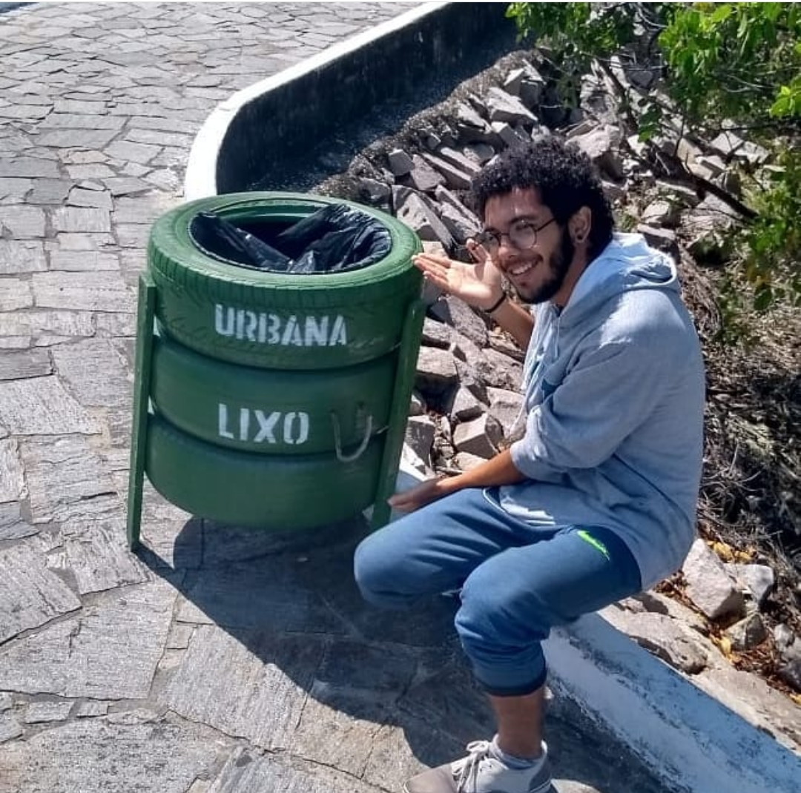
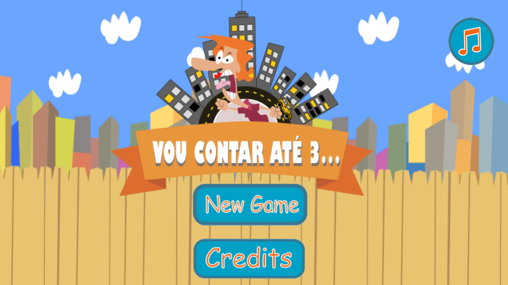
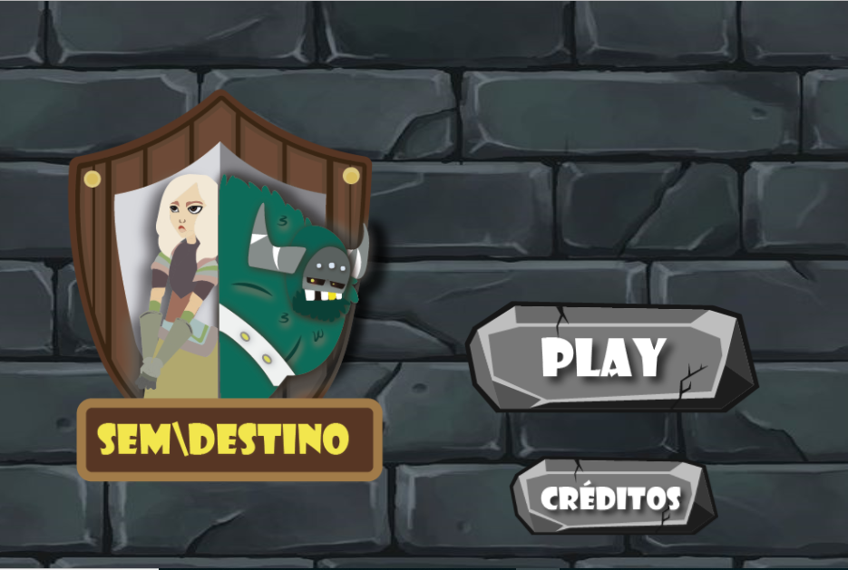
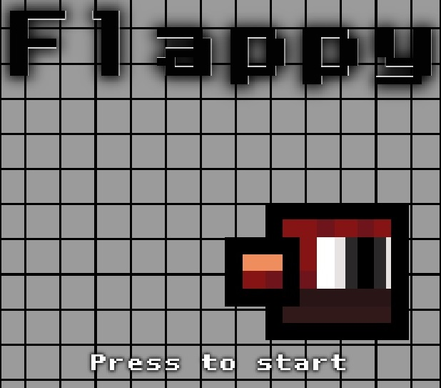

## Meu Portefólio

 

## Quem sou eu?
Pedro Henrique, moro na Cidade de Ielmo Marinho, curso o 3 ano do ensino médio no curso de programação de jogos digitais vespertino. Sou formado em informática básica, estou iniciando na área de ilustração e vetorização de em 2d, tenho conhecimento em  prévio em duas linguagens de programação. Ganhei um campeonato de futsal.
Meus passa tempo é escutar MUITA música, ler HQ, assistir seriado, a coisa que eu mais gosto de assistir e one piece (anime/ desenho produzido no Japão), outro dos passa tempos é dormir, tipo, MUITO...

## Jogos
### 01. jogo

### 02. jogo

### 03. jogo

## Jogos Extras
### 01. jogo

### Projetos

 

**DESCRIÇÃO :_Desenho feito para abertura do jogo referente ao 4 bimestre_

# Contatos

